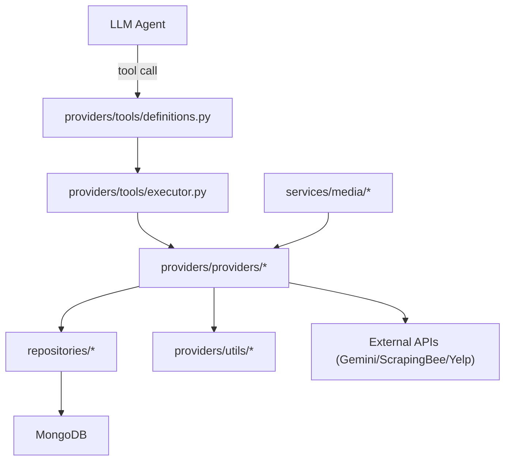

# Data Layer: Structure, Responsibilities, and Tooling Model

## Why this document exists

`wwai_agent_orchestration/data` currently mixes:
- MongoDB access
- external API integrations
- transformation/normalization logic
- LLM tool definitions and execution
- higher-level orchestration (media matching)

This document explains what each folder/file does, gives a practical mental model, and proposes a cleaner structure that is easier to reason about and evolve toward MCP/tool-calling.

---

## Current Folder Overview

```
data/
├── providers/
│   ├── models/       # Pydantic contracts for provider input/output
│   ├── providers/    # concrete provider implementations (DB/API/mixed)
│   ├── tools/        # LLM tool schemas + tool executor
│   └── utils/        # pure parsing and extraction utilities
├── repositories/     # repository/data-access services (Mongo-focused)
└── services/         # orchestration services and domain models
```

### Quick mental map by concern

- **Database access**: mostly `repositories/` + `providers/providers/base_provider.py`
- **External APIs**: `gemini_provider.py`, `scraping_bee_provider.py`, `yelp_provider.py`
- **Pure processing/transforms**: `providers/utils/*`, `services/media/matcher.py`, `services/media/transformer.py`
- **LLM tool surface**: `providers/tools/definitions.py`, `providers/tools/executor.py`
- **Domain orchestration**: `services/media/media_service.py`, `services/media/provider_client.py`

---

## File-by-File Responsibilities

## `providers/models/` (contracts)

- `providers/models/business_profile.py`: unified business profile schemas (address, hours, coordinates, output shape).
- `providers/models/gemini.py`: schemas for Gemini page-intent/context analysis inputs and outputs.
- `providers/models/google_maps.py`: Google Maps normalized input/output schemas.
- `providers/models/logo.py`: logo retrieval input/output schemas.
- `providers/models/media_assets.py`: stock/media asset schema (images/videos and lookup fields).
- `providers/models/reviews.py`: normalized review input/output schema.
- `providers/models/scraped_photos.py`: business and review photo schemas.
- `providers/models/scraper.py`: website scraping input/output and section content schemas.
- `providers/models/yelp.py`: Yelp normalized input/output schemas.
- `providers/models/__init__.py`: model package exports.

## `providers/providers/` (provider implementations)

- `providers/providers/base_provider.py`: shared Mongo helper methods (`get_database`, `find_one`, `find_many`, `upsert_one`, `get_business_trades`) and URL utilities.
- `providers/providers/google_maps_provider.py`: reads Google Maps data from MongoDB and normalizes via parser.
- `providers/providers/yelp_provider.py`: hybrid provider (DB lookup + Yelp RapidAPI calls + DB upsert + transform).
- `providers/providers/business_profile_provider.py`: composes Google Maps + Yelp data into a single business profile.
- `providers/providers/reviews_provider.py`: merges/filters/normalizes reviews from Google Maps and Yelp persisted data.
- `providers/providers/business_photos_provider.py`: extracts business photos from persisted Google Maps payload.
- `providers/providers/review_photos_provider.py`: extracts review photos from persisted Yelp payload.
- `providers/providers/media_assets_provider.py`: loads stock media based on business assigned trades.
- `providers/providers/logo_provider.py`: loads logos (trade-aware).
- `providers/providers/scraping_bee_provider.py`: performs website scraping through ScrapingBee.
- `providers/providers/gemini_provider.py`: performs page-intent analysis through Gemini.
- `providers/providers/__init__.py`: provider package exports.

## `providers/tools/` (LLM tool calling)

- `providers/tools/definitions.py`: OpenAI-style function tool definitions (JSON Schema).
  - current tools: `get_business_profile`, `get_reviews`, `get_media_assets`, `scrape_website`, `analyze_page_intent`
- `providers/tools/executor.py`: tool router and execution layer (`tool_name -> provider -> input model -> result`).
- `providers/tools/__init__.py`: tool package exports.

## `providers/utils/` (pure utility/processing)

- `providers/utils/google_maps_parser.py`: parses raw Google Maps payloads to normalized structures.
- `providers/utils/yelp_parser.py`: parses raw Yelp payloads/API responses to normalized structures.
- `providers/utils/scraper/section_processing.py`: post-processes section detection results.
- `providers/utils/scraper/structured_extraction.py`: extracts structured entities/media/text from HTML.
- `providers/utils/__init__.py`: utils package exports.

## `repositories/` (Mongo repositories)

- `repositories/business_data_storage.py`: store/retrieve business scraped data and trade classification documents.
- `repositories/section_repository.py`: section-repository queries and metadata joins using aggregation pipelines.
- `repositories/trades_repository.py`: trades catalog retrieval.
- `repositories/__init__.py`: repository package exports.

## `services/` (domain orchestration)

- `services/models/media.py`: media matching request/response domain models.
- `services/models/media_asset.py`: internal media asset model used by matching pipeline.
- `services/models/__init__.py`: service model exports.
- `services/media/provider_client.py`: unified media fetch client across stock and business-photo sources.
- `services/media/matcher.py`: matching/scoring algorithm (including source weighting).
- `services/media/transformer.py`: transforms between provider payloads, internal models, Shopify-compatible objects.
- `services/media/media_service.py`: orchestrates end-to-end image/video matching for slot requirements.
- `services/media/__init__.py`: media service exports.
- `services/__init__.py`: services package exports.

## Package roots

- `data/__init__.py`: top-level package initializer.
- `providers/__init__.py`: provider package root export.

---

## Classification Matrix

| Area | Primary role | Typical runtime dependency |
| --- | --- | --- |
| `repositories/*` | DB data access | MongoDB via `db_manager` |
| `providers/providers/base_provider.py` | shared DB helper facade | MongoDB |
| `providers/providers/google_maps_provider.py` etc. | business-facing read/normalize providers | MongoDB + parser utils |
| `providers/providers/scraping_bee_provider.py` | external web scraping | ScrapingBee API |
| `providers/providers/gemini_provider.py` | LLM analysis | Gemini API |
| `providers/providers/yelp_provider.py` | hybrid retrieval with persistence | Yelp API + MongoDB |
| `providers/utils/*` | pure processing | Python + parsing libs |
| `providers/tools/*` | LLM tool contract and execution | provider layer |
| `services/media/*` | orchestration and matching | providers + algorithms |

---

## Data Flow (Current)



---

## Pain Points in Current Structure

1. **Naming friction**: `providers/providers/` is redundant and cognitively noisy.
2. **Boundary blur**: repository-like DB behavior appears both in `repositories/` and `BaseProvider`.
3. **Mixed provider responsibilities**: some providers are read-only DB adapters, some are API adapters, some do both.
4. **Tool visibility gap**: more capabilities exist than are exposed to LLM tools.
5. **Mental model mismatch**: no explicit split between “internal building blocks” and “LLM-callable surface”.

---

## Proposed Structure (Recommended)

Use explicit layers and a dedicated tool surface:

```
data/
├── models/              # all shared pydantic models (provider + service contracts)
├── repositories/        # pure MongoDB access only
├── connectors/          # external API clients only (Gemini, ScrapingBee, Yelp)
├── providers/           # business logic composition (repo + connector + parser)
├── services/            # multi-step orchestration (e.g., media matching)
├── utils/               # pure stateless transformations/parsing
└── tools/               # only LLM/MCP tool schemas, registry, and execution
```

### Layer responsibilities

- **Repositories**: never call external APIs; only DB operations and query contracts.
- **Connectors**: never touch DB; only external API request/response adapters.
- **Providers**: use repositories/connectors and compose domain outputs.
- **Services**: orchestrate multiple providers for higher-level workflows.
- **Tools**: stable LLM-facing interface; thin wrappers over providers/services.

---

## Better Mental Model for the Team

Use a 3-question filter for any new code:

1. **Where does data come from?**
   - MongoDB -> `repositories`
   - external HTTP/SDK -> `connectors`
2. **Who shapes business output?**
   - one source -> `providers`
   - multiple sources/steps -> `services`
3. **Should an LLM call this directly?**
   - yes -> `tools` schema + executor entry
   - no -> keep internal and compose from tool handlers

Practical shortcut:
- If a function has side effects or cost (API call, scraping), treat it as a **tool candidate** only if the call can be safely parameterized and validated.
- If a function is pure transformation, keep it internal utility unless needed for explainability/debug exposure.

---

## LLM Tool Surface: Current vs Recommended

## Current tools (already implemented)

- `get_business_profile`
- `get_reviews`
- `get_media_assets`
- `scrape_website`
- `analyze_page_intent`

## Good next tool candidates

- `get_logos` (from `logo_provider.py`)
- `get_business_photos` (from `business_photos_provider.py`)
- `get_review_photos` (from `review_photos_provider.py`)
- `match_images_to_slots` (from `services/media/media_service.py`)
- `match_videos_to_slots` (from `services/media/media_service.py`)
- `get_section_templates` (from `repositories/section_repository.py` service)
- `get_trade_categories` (from `repositories/trades_repository.py`)

### Selection criteria for MCP/tool exposure

Expose a function as a tool when it is:
- bounded and deterministic enough for clear input/output schema,
- independently useful in agent reasoning,
- safe to invoke repeatedly (or has explicit `force_refresh`/idempotency controls),
- observable (logs + traceable errors),
- permissionable (read-only vs write vs costly external call).

---

## MCP-Oriented Design Notes

The existing executor pattern already maps well to MCP:

- `tool definition` -> MCP `name`, `description`, `inputSchema`
- `execute_tool()` -> MCP `CallTool` handler
- `input_model(...)` validation -> schema validation boundary
- `result.model_dump()` -> MCP content payload

Recommended additions for MCP readiness:

1. Add `tools/registry.py` with metadata:
   - category (`data_retrieval`, `analysis`, `matching`, `external_api`)
   - cost tier (`low`, `medium`, `high`)
   - latency hint
   - side-effect flag
2. Standardize tool errors to a consistent typed envelope.
3. Add lightweight auth/guardrails per tool category.
4. Support tool discoverability (`list_tools`) from one source of truth.

---

## Incremental Migration Plan (Non-Breaking)

1. Create new folders (`connectors`, flattened `tools`, optional unified `models`).
2. Move DB helper behavior from `BaseProvider` into repository base class.
3. Split `yelp_provider.py` into:
   - `connectors/yelp_api_connector.py` (HTTP calls)
   - `providers/yelp.py` (orchestration + persistence coordination)
4. Keep backward-compatible imports through `__init__.py` re-exports while call sites migrate.
5. Expand tool catalog in small batches and validate each tool contract.

---

## External Dependencies Snapshot

- **MongoDB** via `pymongo` and `core.database.db_manager`
  - notable DBs/collections include: `businesses`, `media_management`, `developer_hub_prod`, `trades`
- **Gemini API** via `google.genai`
- **ScrapingBee API** via `scrapingbee`
- **Yelp API (RapidAPI)** via `requests`

Likely environment variables (based on providers):
- `GEMINI_API_KEY`
- `SCRAPINGBEE_API_KEY`
- RapidAPI/Yelp credentials (header-based)

---

## Practical Takeaway

Treat this package as a layered “data and retrieval platform”:
- repositories/connectors = **ingress**
- providers/services = **business intelligence**
- tools = **agent-accessible API**

Once this boundary is explicit, it becomes much easier to:
- reason about ownership,
- add MCP-compatible tools safely,
- test each layer independently,
- and scale orchestration without increasing coupling.
